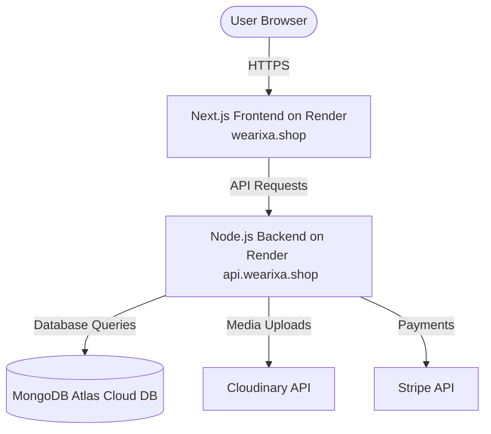

# Wearixa Deployment Guide (Render & Hostinger)

This guide walks you through deploying the **Node.js/Express Backend** and **Next.js Frontend** to [Render](https://render.com/), setting up the database on **MongoDB Atlas**, and configuring your custom domain registered at **Hostinger**.

---

## 🚀 Architecture Overview


---

## 📁 Prerequisites
1. A **GitHub repository** containing your code (e.g. `https://github.com/detective01-tech/wearixa`).
2. A **Render account** (linked to your GitHub).
3. A **MongoDB Atlas account** (Free tier for hosting the MongoDB).
4. A **Hostinger account** where your domain is registered.

---

## 1. MongoDB Atlas Setup (Free Database)
Since Render does not offer a free native MongoDB database, you must host your database on MongoDB Atlas (Free Tier):

1. **Create an Account:** Sign up at [mongodb.com/atlas](https://mongodb.com/atlas).
2. **Create a Cluster:** Create a new deployment, choose the **M0 Free Tier**, select your preferred cloud provider (e.g., AWS) and region nearest to your target users.
3. **Database User:** Under **Database Access**, create a user with a secure password and save the credentials. Make sure they have `readWriteAnyDatabase` role.
4. **Network Access:** Under **Network Access**, click **Add IP Address**.
   > [!IMPORTANT]
   > Since Render free-tier services do not have static IP addresses, you should add `0.0.0.0/0` (Allow Access from Anywhere) so Render servers can connect to your database.
5. **Get Connection String:** Click on **Database** > **Connect** > **Drivers**. Copy your connection string. It will look like this:
   ```text
   mongodb+srv://<username>:<password>@cluster0.xxxx.mongodb.net/?retryWrites=true&w=majority&appName=Cluster0
   ```
   Replace `<password>` with your database user password and insert a database name (e.g. `wearixa`) before the `?` character.

## 🚀 Deployment Option A: Auto-Deployment with Render Blueprints (Recommended)
This repository includes a [render.yaml](file:///d:/wearixa/render.yaml) file at the root. Render can read this file to automatically configure, build, and deploy both your frontend and backend services in one go!

1. Make sure you have committed and pushed the [render.yaml](file:///d:/wearixa/render.yaml) file to your GitHub repository.
2. Go to the [Render Dashboard](https://dashboard.render.com/).
3. Click **New +** in the top right, and select **Blueprint**.
4. Select and connect your `wearixa` repository.
5. Render will automatically parse [render.yaml](file:///d:/wearixa/render.yaml) and present you with form fields to input all of your environment variables (like your MongoDB Atlas URL, Stripe keys, Cloudinary credentials, etc.).
6. Fill in the values and click **Apply**. Render will automatically provision both services and begin building.

---

## 🛠️ Deployment Option B: Manual Service Setup
If you prefer to configure the services manually, follow the steps below.

### 2. Deploying the Backend on Render
Your Express API will run as a Render **Web Service**.

1. Log in to [Render Dashboard](https://dashboard.render.com/) and click **New +** > **Web Service**.
2. Connect your GitHub repository.
3. Configure the service details:
   - **Name:** `wearixa-backend`
   - **Root Directory:** `backend`
   - **Language/Runtime:** `Node`
   - **Build Command:** `npm install`
   - **Start Command:** `node server.js` (or `npm start`)
   - **Instance Type:** `Free`
4. Click **Advanced** to expand options and add the following **Environment Variables**:

| Variable Name | Value / Description |
| :--- | :--- |
| `NODE_ENV` | `production` |
| `PORT` | `5000` |
| `MONGO_URI` | Paste your MongoDB Atlas Connection String from Step 1 |
| `JWT_SECRET` | Create a strong, unique random string |
| `CLOUDINARY_CLOUD_NAME` | Your Cloudinary cloud name |
| `CLOUDINARY_API_KEY` | Your Cloudinary API key |
| `CLOUDINARY_API_SECRET` | Your Cloudinary API secret |
| `STRIPE_SECRET_KEY` | Your Stripe secret key (e.g. `sk_test_...`) |
| `STRIPE_WEBHOOK_SECRET` | Your Stripe webhook signing secret (e.g. `whsec_...`) |
| `EMAIL_USER` | Your email address (e.g., Gmail) |
| `EMAIL_FROM` | Sender identity header (e.g. `Wearixa Shop <your_email@gmail.com>`) |
| `OAUTH_CLIENT_ID` | Your Google OAuth Client ID |
| `OAUTH_CLIENT_SECRET` | Your Google OAuth Client Secret |
| `OAUTH_REFRESH_TOKEN` | Your Google OAuth Refresh Token |
| `FRONTEND_URL` | Temporarily use `https://wearixa-frontend.onrender.com` (We will update this once custom domain is set up) |
| `BACKEND_URL` | `https://wearixa-backend.onrender.com` (Your backend Render URL) |

5. Click **Create Web Service**. Wait for the deployment to finish.
6. Once deployed, copy your backend URL (e.g. `https://wearixa-backend.onrender.com`). Verify it is running by visiting it in your browser; it should display `API is running...`.

---

### 3. Deploying the Frontend on Render
Your Next.js client will run as a Render **Web Service**.

1. In the Render Dashboard, click **New +** > **Web Service**.
2. Connect your GitHub repository.
3. Configure the service details:
   - **Name:** `wearixa-frontend`
   - **Root Directory:** `frontend`
   - **Language/Runtime:** `Node`
   - **Build Command:** `npm install && npm run build`
   - **Start Command:** `npm start`
   - **Instance Type:** `Free`
4. Click **Advanced** and add the following **Environment Variables**:

| Variable Name | Value / Description |
| :--- | :--- |
| `NEXT_PUBLIC_API_URL` | `https://wearixa-backend.onrender.com/api` (Replace with your actual Render Backend URL) |
| `NEXT_PUBLIC_STRIPE_PUBLISHABLE_KEY` | Your Stripe Publishable Key |
| `NODE_VERSION` | `20` (Ensures a modern Node runtime matches Next.js requirements) |

> [!IMPORTANT]
> Next.js embeds environment variables starting with `NEXT_PUBLIC_` into the static JavaScript bundles during the **build step**.
> Therefore, you must add these variables **before** deploying, or trigger a manual rebuild after adding/changing them.

5. Click **Create Web Service** and wait for deployment. Once completed, your Next.js app will be accessible at your Render URL (e.g., `https://wearixa-frontend.onrender.com`).

---

## 4. Custom Domain Setup (Hostinger)
To link your custom domain (e.g. `wearixa.shop`) to Render:

### Phase A: Configure Custom Domains in Render
1. **Frontend Service (`wearixa-frontend`):**
   - In Render, go to your frontend service page, select **Settings** from the sidebar, and scroll down to the **Custom Domains** section.
   - Click **Add Custom Domain**.
   - Add both your apex domain (e.g., `wearixa.shop`) and subdomain (e.g., `www.wearixa.shop`).
   - Render will display instructions for DNS setup containing:
     - An **A Record** (IP address, e.g. `216.24.57.1`).
     - A **CNAME Record** pointing to your Render app URL (e.g. `wearixa-frontend.onrender.com`).

2. **Backend Service (`wearixa-backend`):**
   - To make API endpoints clean, you can map `api.wearixa.shop` to your backend.
   - Go to your backend service -> **Settings** -> **Custom Domains** -> **Add Custom Domain**.
   - Add `api.wearixa.shop`.
   - Render will provide a **CNAME** pointing to `wearixa-backend.onrender.com`.

---

### Phase B: Configure DNS Records in Hostinger
1. Log in to your **Hostinger hPanel**.
2. Navigate to **Domains** and select your domain (e.g., `wearixa.shop`).
3. Click on **DNS / Nameservers** on the sidebar.
4. **Delete conflicting records:** Look for any existing `A` records with host `@` or `CNAME` records with host `www` or `api` and delete them to prevent configuration conflicts.
5. **Add the new DNS records:**

| Type | Name (Host) | Points To / Value | TTL |
| :--- | :--- | :--- | :--- |
| **A** | `@` | `216.24.57.1` (Paste the IP Render provided) | `14400` or `3600` |
| **CNAME** | `www` | `wearixa-frontend.onrender.com` | `14400` or `3600` |
| **CNAME** | `api` | `wearixa-backend.onrender.com` | `14400` or `3600` |

6. Save the records and wait for DNS propagation (this typically takes from a few minutes to up to 24 hours). Render will automatically generate SSL certificates for your domain names once verified.

---

### Phase C: Final Environment Variable Update
Now that your custom domains are active, update your Render environment variables to match:

1. **In `wearixa-backend` Environment Variables:**
   - Change `FRONTEND_URL` to `https://wearixa.shop`
   - Change `BACKEND_URL` to `https://api.wearixa.shop`
   - Save changes. Render will automatically redeploy the backend service.

2. **In `wearixa-frontend` Environment Variables:**
   - Change `NEXT_PUBLIC_API_URL` to `https://api.wearixa.shop/api`
   - Save changes.
   - Click **Manual Deploy** > **Clear Cache & Deploy** to ensure the build embeds the updated domain.

---

## 🛡️ Troubleshooting Checklist
- [ ] **Database Connection Errors:** Verify your MongoDB Atlas network access list includes `0.0.0.0/0`.
- [ ] **CORS issues:** Verify the backend environment variable `FRONTEND_URL` matches your frontend domain (e.g. `https://wearixa.shop` with no trailing slash).
- [ ] **Stripe Checkouts failing:** Ensure `STRIPE_SECRET_KEY` is set correctly on the backend, and that the Stripe Webhook in the Stripe Dashboard points to `https://api.wearixa.shop/api/payments/stripe-webhook`.
- [ ] **Next.js fetching wrong backend:** Clear cache and redeploy the frontend in Render if `NEXT_PUBLIC_API_URL` was changed, as it needs to compile into the production bundles.
